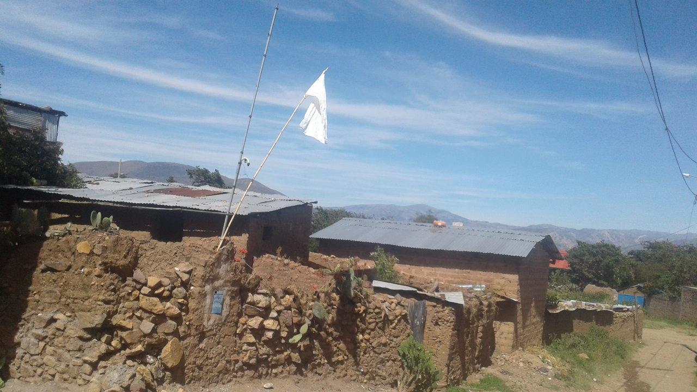

# mark-images
Mark image with other image (such as a logo)


## Requirements
- GO

## Example
1. Input: Choose a image


2. Input: A logo


3. Output: Image with a logo at the upper right corner of the image


## To run
```sh
$ go run main.go
```
